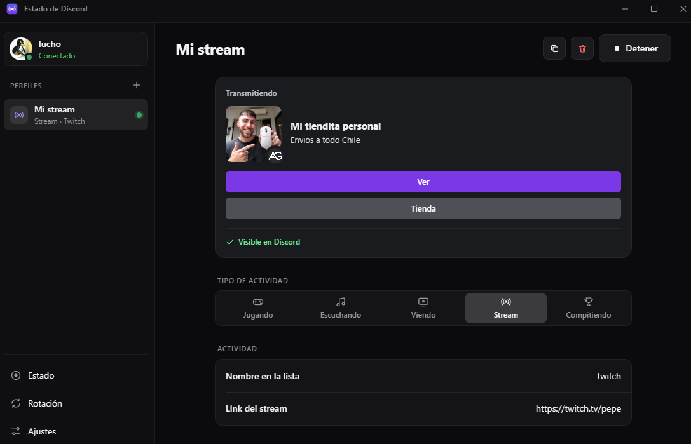
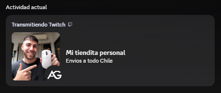
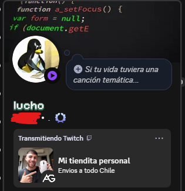

# Estado de Discord

App de escritorio para Windows que pone una actividad personalizada en tu perfil de Discord: jugando, transmitiendo, escuchando, viendo o compitiendo, con imágenes, botones y temporizador. Queda corriendo en la bandeja del sistema y puede partir junto con Windows.



Así se ve en Discord:

<p>
  
  
</p>

## Qué hace

- **Perfiles.** Cada perfil guarda un tipo de actividad, nombre, detalles, texto, URL de stream, imagen grande, imagen chica, hasta dos botones con link y un modo de tiempo (transcurrido o cuenta regresiva).
- **Rotación de textos.** Si un perfil tiene varios detalles o textos, la app los va cambiando cada cierto tiempo (mínimo 15 segundos).
- **Rotación de perfiles.** Pasa de un perfil a otro cada N minutos (mínimo 1).
- **Estado personalizado.** Texto y emoji propios, además del punto de conexión: en línea, ausente, no molestar o invisible.
- **Imágenes.** Acepta una URL o un archivo local. Los archivos se suben a freeimage.host y Discord los recibe como assets externos de la aplicación.
- **Aviso de actividad oculta.** Detecta cuando la opción "Compartir tu actividad" está apagada en Discord y la activa con un clic.
- **Bandeja del sistema.** Al cerrar la ventana, la app sigue activa. El menú de la bandeja permite abrirla, quitar la actividad o salir.

## Cómo funciona

La interfaz es HTML, CSS y JavaScript dentro de una ventana de [pywebview](https://pywebview.flowrl.com/). Python expone una API a la interfaz y maneja todo lo demás:

```
app.py              ventana, bandeja del sistema y API que usa la interfaz
nucleo/
  gateway.py        conexión WebSocket al gateway de Discord (identify, heartbeat, reconexión)
  actividad.py      arma el objeto de actividad que Discord espera
  rotacion.py       decide qué perfil y qué texto mostrar en cada momento
  config.py         valida y guarda la configuración en %APPDATA%\EstadoDiscord
  imagenes.py       sube imágenes y las convierte en assets de Discord
  sistema.py        inicio con Windows (registro) e instancia única (mutex)
ui/                 interfaz
tests/              pruebas de actividad, configuración y rotación
```

La conexión se reintenta con espera exponencial (de 2 a 60 segundos) y se detiene si Discord rechaza el token. Los cambios de actividad se envían como máximo cada 2 segundos.

## Requisitos

- Windows 10 u 11 con WebView2 (viene instalado en Windows 11).
- Python 3.11 o superior.

## Instalar y ejecutar

```bash
git clone https://github.com/UiUyHerrera/estado-discord.git
cd estado-discord
pip install -r requirements.txt
python app.py
```

Al abrir la app, pega tu token de Discord. Se guarda solo en `%APPDATA%\EstadoDiscord\token.txt`. También se puede pasar con la variable de entorno `DISCORD_TOKEN`.

Con `python app.py --oculto` la app parte minimizada en la bandeja.

## Pruebas

```bash
pip install -r requirements-dev.txt
python -m pytest
```

## Generar el .exe

```bash
pyinstaller --noconsole --onefile --name EstadoDiscord --icon ui/icono.ico --add-data "ui;ui" app.py
```

El ejecutable queda en `dist/EstadoDiscord.exe`.

## Advertencia

La app se conecta con el token de tu cuenta de usuario. Automatizar una cuenta de usuario va contra los términos de servicio de Discord y la cuenta puede ser suspendida. Úsala bajo tu propio riesgo.

Nunca compartas tu token: con él cualquiera puede entrar a tu cuenta. Si crees que se filtró, cambia tu contraseña de Discord, porque eso invalida el token.
